<!--
  profile readme — lives in the public FelixMatrixar/FelixMatrixar repo
  and renders on https://github.com/FelixMatrixar.

  the svgs are generated: edit scripts/build.mjs, then `node scripts/build.mjs`.
  dark theme = qa side (warm black / orange), light theme = dev side (cool / blue),
  wired to github's theme via <picture>.
-->

  <picture>
    <source media="(prefers-color-scheme: dark)" srcset="assets/hero-dark.svg">
    
  </picture>

  
  
  

&nbsp;

### about

qa engineer and fullstack developer. i find the edge cases specs miss, then automate them so the same bug never ships twice. i build products end to end: react to fastapi, models to data pipelines, typed and tested in production.

currently keeping releases boring at **cicon ltd** and building the frontend base at **[brik.space](https://brik.space)**. i like my ai load-bearing: real state, strict json, one deterministic write path. if it can't be verified, it doesn't ship.

&nbsp;

### stack

  <picture>
    <source media="(prefers-color-scheme: dark)" srcset="assets/ticker-dark.svg">
    
  </picture>
  <picture>
    <source media="(prefers-color-scheme: dark)" srcset="assets/stack-dark.svg">
    
  </picture>

&nbsp;

### stats

<!-- self-generated from the github api (scripts/stats.mjs), refreshed weekly
     by .github/workflows/stats.yml — no third-party card service -->

  <picture>
    <source media="(prefers-color-scheme: dark)" srcset="assets/gh-stats-dark.svg">
    
  </picture>

&nbsp;

### reach me

**[portfolio ↗](https://portfolio-qadence.vercel.app/)** for case studies, certs, and a live image generation playground

~ releases, made boring.
